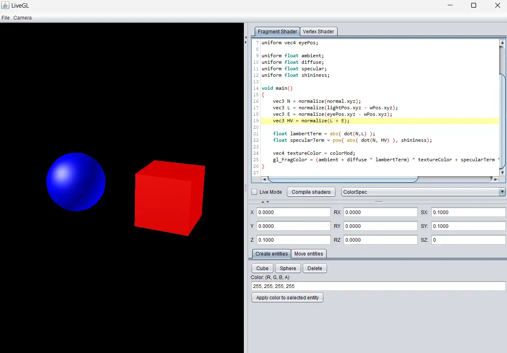

# LiveGL

Real time demo of an OpenGL vertex and fragment shader editor. Written in Java using Java swing and other old stuff.

The main feature of the program is the ability to edit shaders live, they are compiled and executed in real time.

